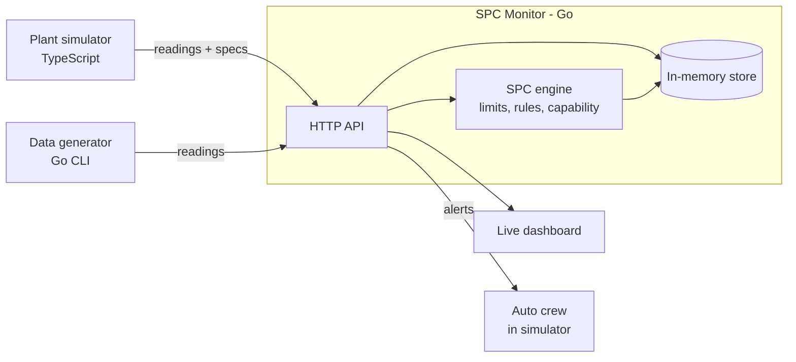

# SPC Monitor

**Demo video:** [Watch the simulator running](EV%20Battery%20%26%20SPC%20Monitor%20Video/Spc-%26-Production%20Line%20Monitor-Video.mp4)

A real-time **statistical process control** service written in Go. It takes in measurements from production stations, learns what "normal" looks like for each one, and flags process drift **before** it turns into defective parts.

It's built to pair with the [EV Battery Plant Simulator](https://github.com/bladesdaniel-bot/ev-battery-plant-simulator). Together they form a closed loop: a hidden process problem starts, the monitor detects it, and an automated maintenance crew is dispatched to fix the root cause, with no human in the loop.

<!-- Demo GIF goes here -->

## Why SPC

Pass/fail inspection only reports a problem once parts are already out of spec. SPC watches the *pattern* of measurements, so it catches a process that is drifting while every part is still good. In the simulator demo, SPC flags laser weld optics contamination well before the plant's own defect alarm fires.

## Features

- **I-MR control charts** with limits locked to a baseline, so a drifting process can't drag its own limits along with it
- **Western Electric rules**: a point beyond 3σ, 2 of 3 beyond 2σ, 4 of 5 beyond 1σ, and 8 in a row on one side of center
- **Moving range chart** to catch a process that becomes erratic even when its average hasn't moved
- **Process capability**: Cp, Cpk, Pp and Ppk against engineering spec limits, color coded to automotive benchmarks
- **Live dashboard** served by the Go binary itself, with no external dependencies
- **Test data generator** that simulates stable, drifting, shifted and spiking processes
- **CORS support**, so browser-based systems like the plant simulator can stream readings directly

## Architecture



## Quick start

Requires Go 1.22 or newer.

```bash
git clone https://github.com/bladesdaniel-bot/spc-monitor.git
cd spc-monitor
go run ./cmd/spc-monitor
```

Open http://localhost:8090 for the dashboard. In a second terminal, send a drifting process and watch the monitor catch it:

```bash
go run ./cmd/generator -mode drift
```

Generator modes are `stable`, `drift`, `shift` and `spike`. Run `go run ./cmd/generator -h` for all options.

## API

| Method | Endpoint | Description |
|---|---|---|
| GET | `/` | Live dashboard |
| GET | `/health` | Service health check |
| GET | `/series` | Every station and characteristic with its reading count |
| POST | `/measurements` | Add a reading: `station`, `characteristic`, `value`, optional `timestamp` |
| GET | `/measurements?station=&characteristic=` | All readings for one series |
| GET | `/limits?station=&characteristic=` | Control limits from the baseline |
| GET | `/violations?station=&characteristic=` | Limits, rule violations, MR violations, and capability if specs are set |
| PUT | `/specs` | Set spec limits: `station`, `characteristic`, `lsl`, `usl` |

`/limits` and `/violations` accept an optional `baseline=N` (default 20).

## How it works

**Control limits.** The first 20 readings of each series form the baseline. Sigma is estimated from the average moving range (MR-bar / 1.128), and the limits are set at the center line ± 3σ. These limits are then locked, and every later reading is judged against them.

**Rules.** Each reading is converted into sigmas from center and checked against the four Western Electric rules. Rules 3 and 4 catch small, sustained drifts that never cross a control limit.

**Capability.** Over the most recent 50 readings, Cp and Cpk use short-term sigma from moving ranges, while Pp and Ppk use the overall standard deviation. A gap between Cp and Cpk means the process is off center. A gap between Cpk and Ppk means it is moving over time.

## Project structure

```
cmd/spc-monitor/     HTTP server and embedded dashboard
cmd/generator/       Test data generator
internal/spc/        Control limits, rules, and capability math
internal/store/      Thread-safe in-memory measurement store
```

## Roadmap

- CUSUM and EWMA charts for faster detection of small drifts
- Alert acknowledgement with recorded cause and corrective action
- Server-Sent Events for instant alert delivery
- Persistent storage
- Unit tests and CI